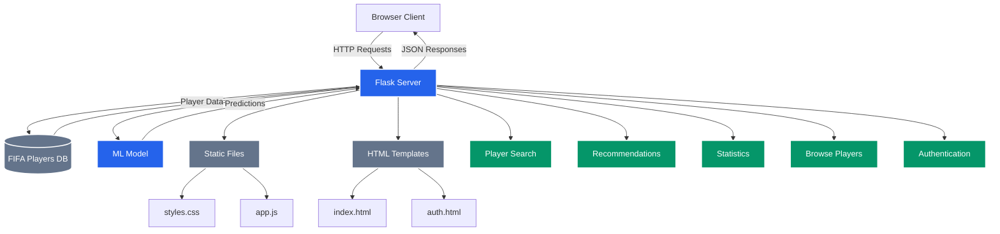

# FIFA Player Recommender - Architecture Overview

## Component Description

### Core Components
- **Flask Server**: Main backend server handling all requests and business logic
- **ML Model**: Machine learning model for player recommendations and predictions
- **FIFA Players DB**: Database storing all player information and statistics

### Frontend
- **Static Files**:
  - `styles.css`: Global styling and UI components
  - `app.js`: Client-side JavaScript for interactivity
- **Templates**:
  - `index.html`: Main application interface
  - `auth.html`: Authentication pages

### Main Features
1. **Player Search**: Advanced search with multiple filters
2. **Recommendations**: AI-powered player recommendations
3. **Statistics**: Global stats and player rankings
4. **Browse Players**: Interactive player browsing interface
5. **Authentication**: User management and security

### Data Flow
- Client makes requests to Flask server
- Server interacts with database and ML model
- Responses are sent back as JSON
- Frontend renders data using JavaScript
- Real-time updates and interactive UI

## Technology Stack
- **Backend**: Python/Flask
- **Frontend**: HTML, CSS, JavaScript
- **Database**: CSV/DataFrame processing
- **ML**: Scikit-learn for recommendations
- **UI**: Custom responsive design