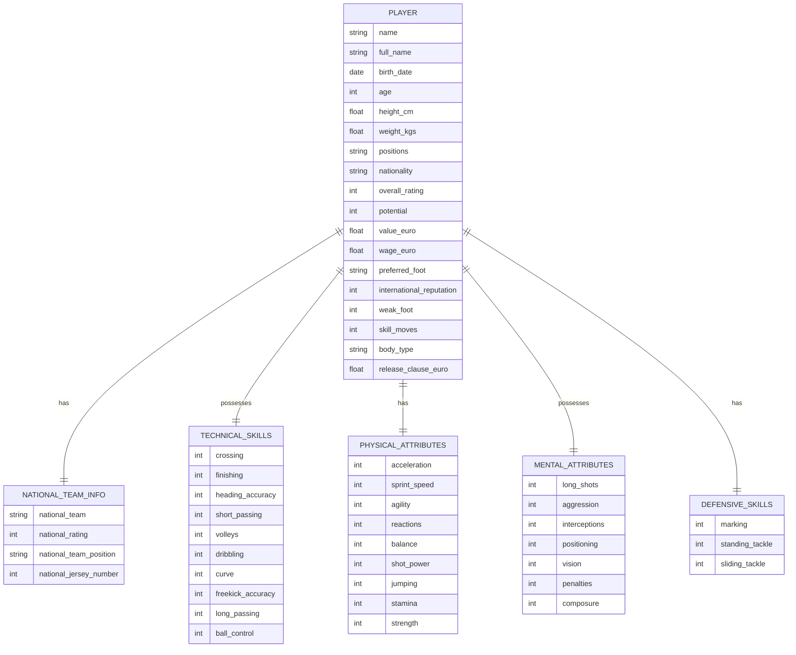
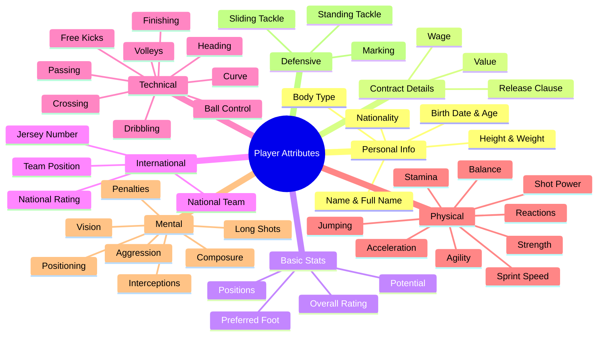
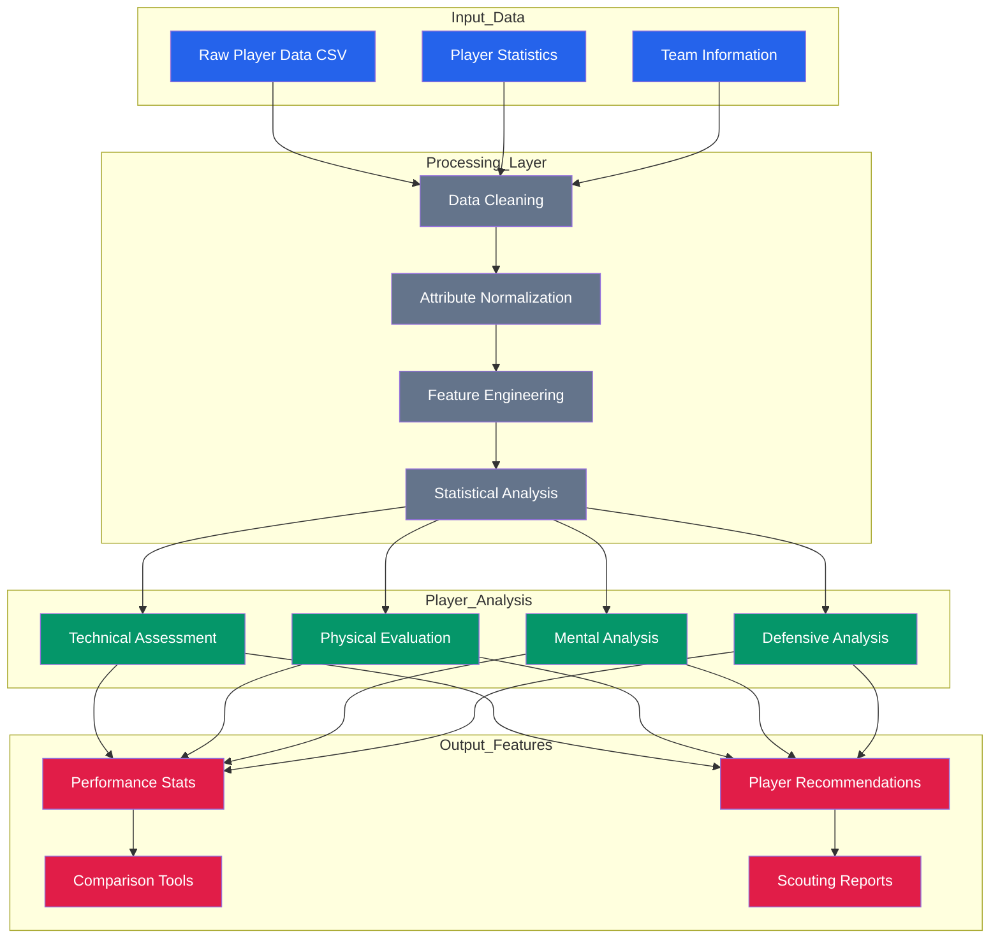
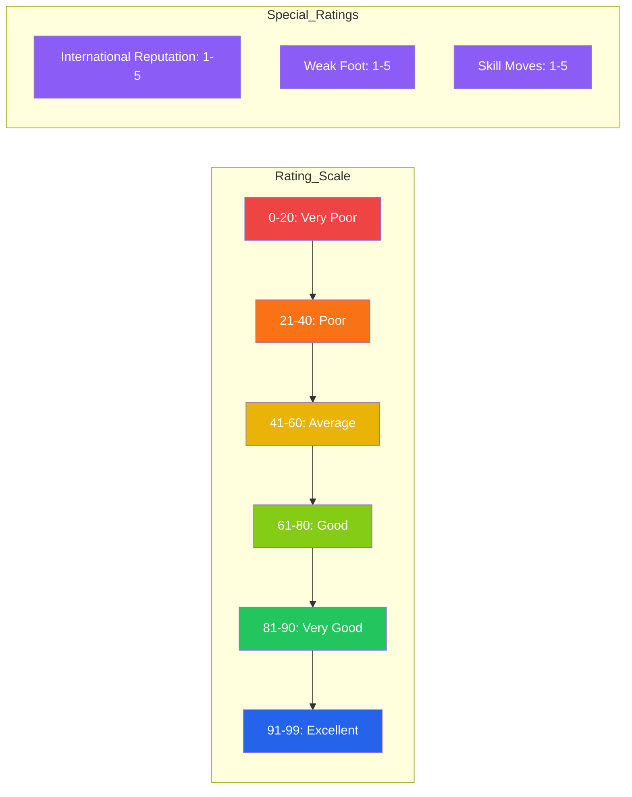
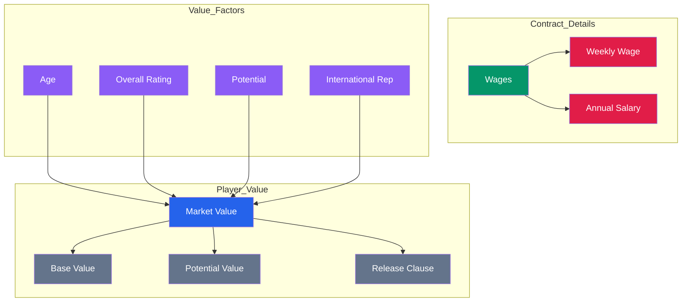
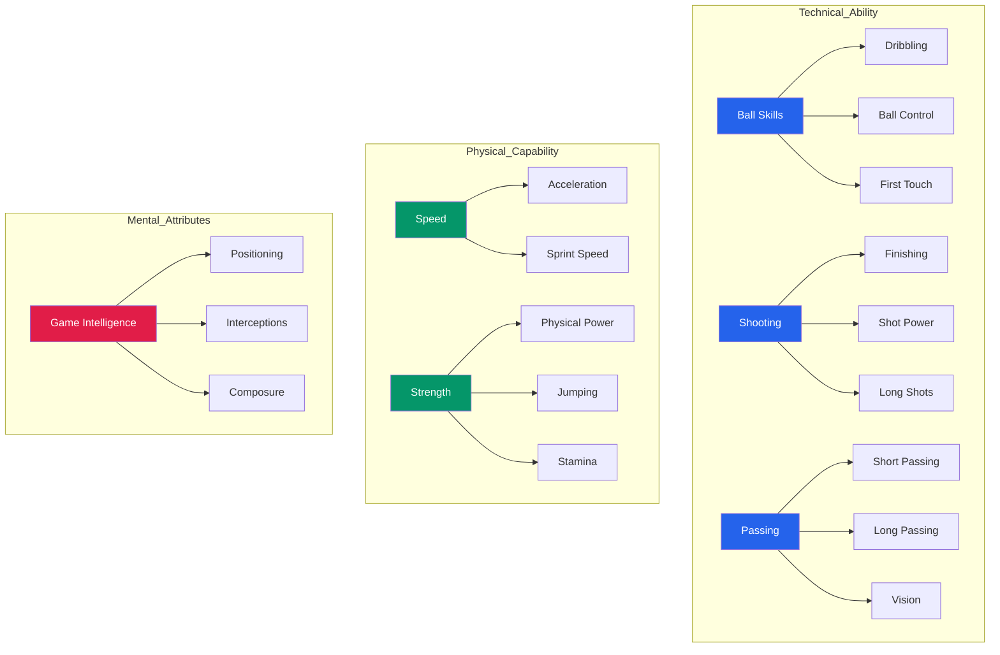

# FIFA Players Dataset - Complete Attributes Visualization 

## Player Data Model

## Attribute Categories Breakdown

## Data Flow and Processing

## Skill Ratings Scale

## Value and Contract Structure

## Player Performance Metrics

## Player Attributes Details

### Personal Information
- Name and Full Name
- Birth Date and Age
- Height (cm) and Weight (kg)
- Nationality
- Body Type
- Positions

### Performance Ratings
- Overall Rating (0-99)
- Potential Rating (0-99)
- International Reputation (1-5)
- Weak Foot Rating (1-5)
- Skill Moves Rating (1-5)

### Technical Attributes
- Ball Control and Dribbling
- Passing (Short and Long)
- Shooting and Finishing
- Free Kicks and Penalties
- Crossing and Curve

### Physical Attributes
- Speed (Acceleration and Sprint)
- Strength and Stamina
- Agility and Balance
- Jumping
- Reactions

### Mental Attributes
- Vision and Composure
- Positioning
- Aggression
- Interceptions
- Long Shots

### Defensive Attributes
- Marking
- Standing Tackle
- Sliding Tackle

### Economic Values
- Market Value (Euro)
- Wage (Euro)
- Release Clause (Euro)