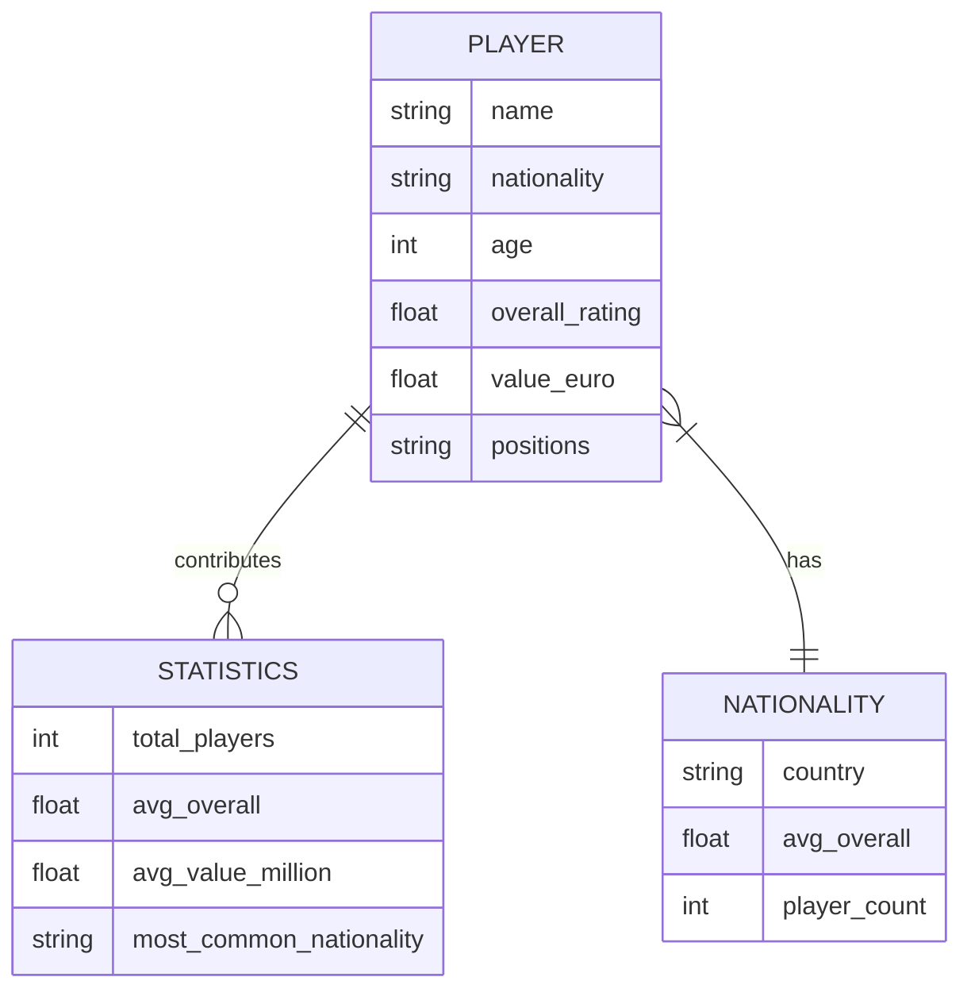
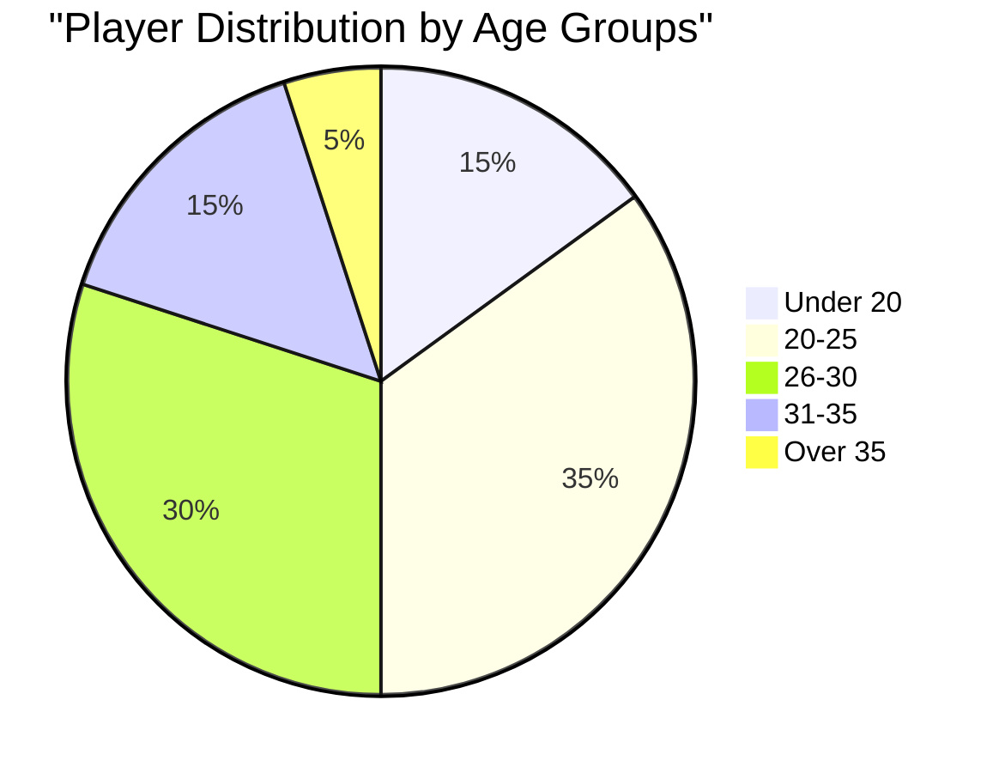
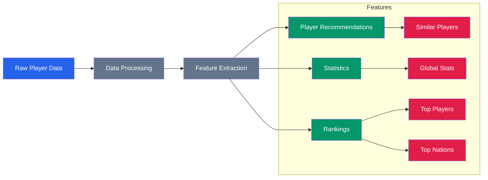
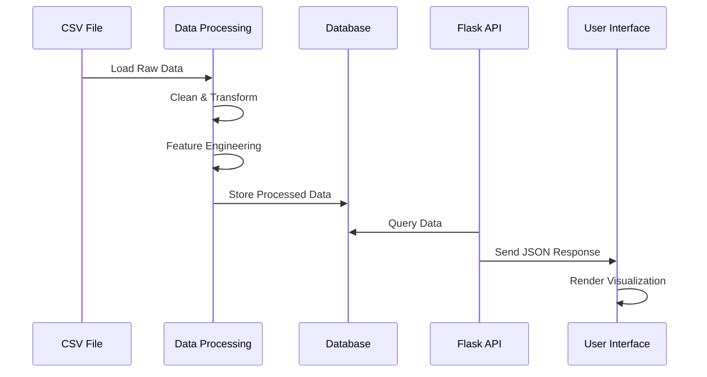
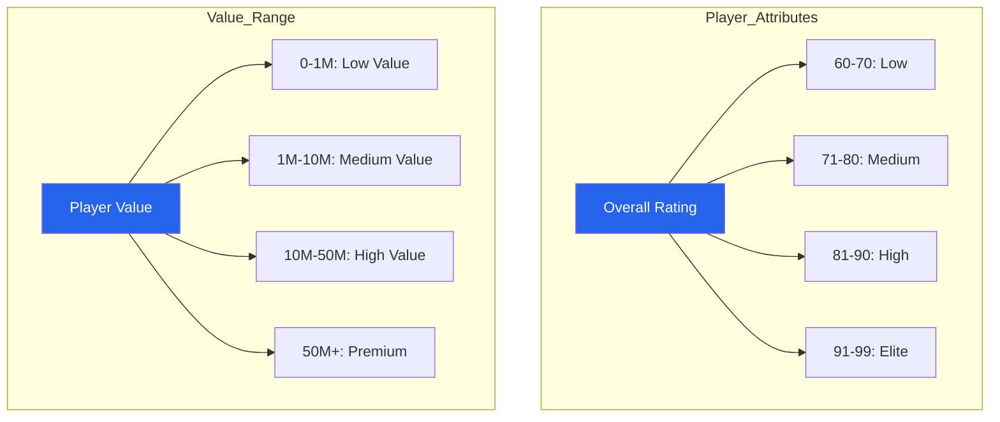
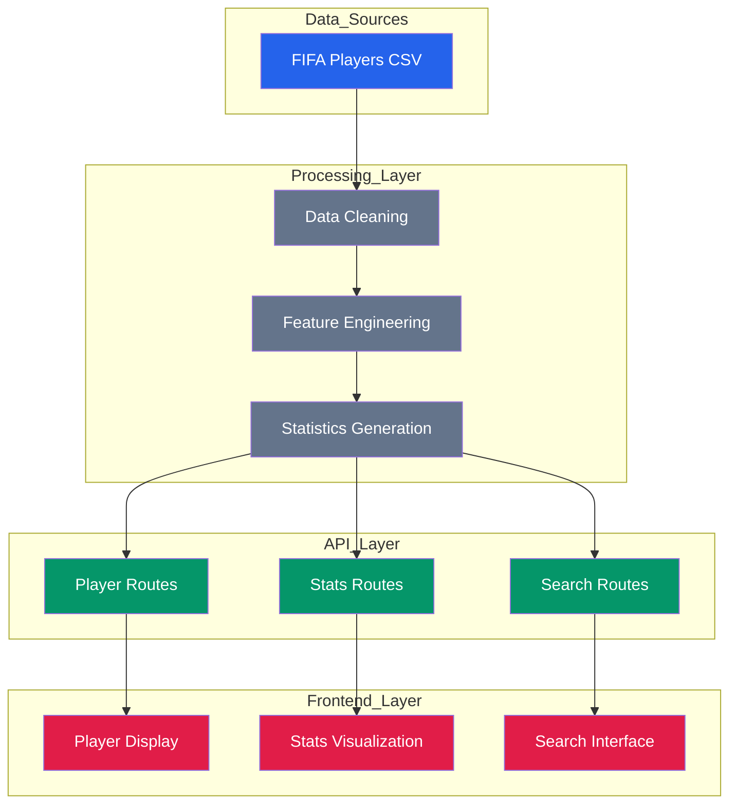

# FIFA Players Dataset Visualization

## Dataset Structure and Features

## Data Distribution Overview

## Key Features Flow

## Data Processing Pipeline

## Key Statistics

### Player Attributes Distribution

## Data Flow Architecture

## Features Summary

### Player Attributes
- Name
- Nationality
- Age
- Overall Rating
- Value (in Euros)
- Positions

### Statistical Features
- Total Players Count
- Average Overall Rating
- Average Player Value
- Most Common Nationality
- Position Distribution
- Age Distribution

### API Endpoints
- `/stats`: Global statistics
- `/top/players`: Top players by various metrics
- `/top/nations`: Top nations by average rating
- `/search`: Player search functionality
- `/recommend`: Similar player recommendations

### User Interface Components
- Player Search Form
- Statistics Display
- Player Rankings
- Nation Rankings
- Data Visualizations

## Data Processing Steps

1. **Data Loading**
   - Load CSV file
   - Parse data types
   - Handle missing values

2. **Data Cleaning**
   - Remove duplicates
   - Normalize values
   - Standardize formats

3. **Feature Engineering**
   - Calculate derived metrics
   - Generate rankings
   - Create aggregations

4. **API Integration**
   - Convert to JSON format
   - Implement filtering
   - Enable sorting
   - Support pagination

5. **Frontend Display**
   - Render tables
   - Display charts
   - Show statistics
   - Enable interactivity